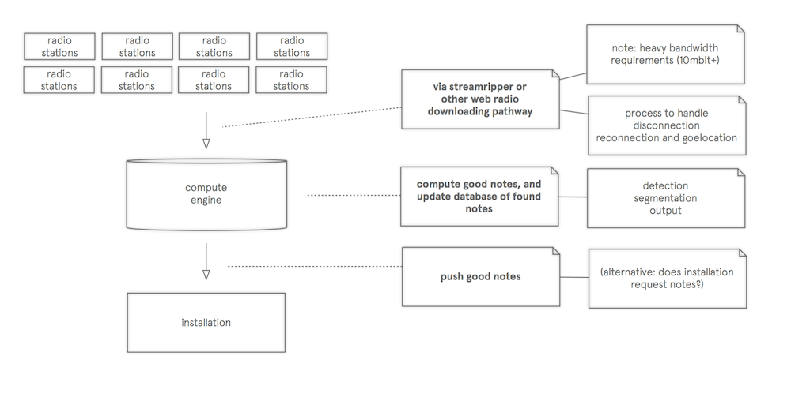

here's a very simple diagram explaining how the installation will work.  It's very minimal at the moment (there's many pieces of software and different systems that fit together) and I'll definitely be updating it as the project progresses. 

I imagine there's going to be at least three main pieces of software to make this work: 

* connect to and manage radio stations streaming
* find good notes in the audio stream
* push good notes and relevant info downstream to the installation

At the moment, my main focus has been on the middle part, finding good notes, but I'm starting to experiment with downloading radio station content, at the moment starting with command line tools such as [streamripper](http://streamripper.sourceforge.net/). 
