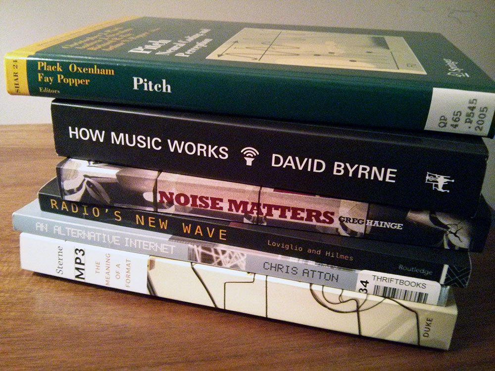

I've started a bit of a reading list for this project.  I find it's kind of useful since it's easy to get caught deep in coding to spend some time trying to pull out useful approaches, arguments, and research to inform the work.  Also, I get to the point sometimes where I've seen the same google results over and over and over again.  When all the links are purple instead of blue, since I've clicked on them, it's time to head to books for insight. 

There's a few books such as "Radio's New Wave" edited by Lovigilio and Hilmes and "An Alternative internet" by Chris Atton that are cultural studies / readers.  The Loviglio book, which is essentially a series of esssays by different authors has some great ideas about artistic practice and radio, and how the internet has changed radio.  It reminds me to look at Cage's radio work. "Noise Matters", by Hainge, is an attempt to finder a better, more useful classification of noise.  David Byrne's "How music works" discusses how context informs content and artistic expression.   The Pitch book by Oxenham and Popper dives into different ways of thinking about pitch and how we perceive it.  Finally Sterne's "MP3: The meaning of a format" is a deep investigation of the format of mp3, which has long roots in perceptual studies, telephony (which he argues is often overlooked in media studies), and signal theory.  It's something we come into contact with on a daily basis, and it makes internet radio possible, so it's very useful to try to understand the where this format comes from, as the assumptions and decisions by the people who designed it have really big impact about what sounds it supports. 

I'll try to write more about the books as I get into them.  For now, if you are interested, there are two interviews with two of the authors that are nice overviews: 

- http://newbooksincriticaltheory.com/2013/10/19/greg-hainge-noise-matters-towards-an-ontology-of-noise-bloomsbury-academic-2013/
- http://newbooksinscitechsoc.com/2013/10/10/jonathan-sterne-mp3-the-meaning-of-a-format-duke-up-2012/

(the noise interview ironically has a ton of feedback, but it's quite interesting if you can ignore it) 
