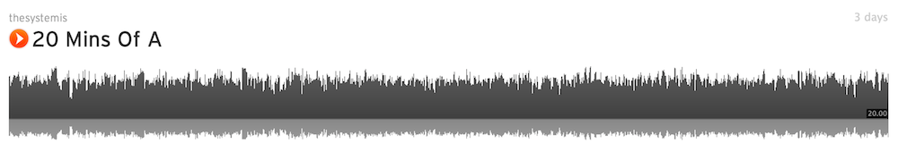

I'm finding that chroma seems to work pretty well for finding notes. 

Using NNLS-Chroma, which as some settings that are pretty adjustable and a healthy amount of median filtering, I was able to pull notes using chroma.  I recorded 1000 radio stations for about 1 minute each, and pulled out every moment where the chroma energy for a particular note was high.   

I found sox, the command line audio tool, extremely helpful.  I would take a given recording, process it via the VAMP plugin, load in the data, and whenever I needed to make a "note" from a recording, I'd use the command line program sox to make the copy.  It has built in trim functionality.  I wound up with about 50,000 samples -- I used a low-ish threshold, but I'll start seeing what happens when I raise it.   

Here's what happens when you use sox and put all the samples of the note A together -- it's 20 minutes of A [on soundcloud](https://soundcloud.com/thesystemis/20-mins-of-a)): 

*if you want to check this, use [onlinetonegenerator.com](http://onlinetonegenerator.com) and try 440HZ.  I'm attempting to find tones that sound like this or some octave of this.*

here's a quick video of me noodling with a keyboard -- I took these samples which I have only classified by note (chroma only gives back note not octave info) and I tried to sort them by octave.  This is a very rough sort, and I'm using sox's rough frequency, returned by `-n stat`.  here's a small snippet that runs sox and uses sed to get the numberic value out: 

	 /usr/local/bin/sox mySample.wav -n stat 2>&1 | sed -n 's#^Rough [^0-9]*\\([0-9.]*\\)$#\\1#p' 2>&1 ";

here's a keyboard made from these samples now that I can place them in octaves: 

https://www.youtube.com/watch?v=ZWjm3vR4G04&feature=youtu.be

