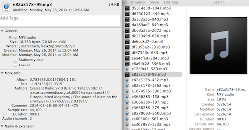

One of the major challenges I'm finding is how to store data for each found note.  I was originally using text files and considered moving to a database, but then I remembered that mp3s have a meta-data that you can store information in about the artist, track, albumb, etc.  

I've started using that to store info about recordings: 

In the code, I'm using a few libraries that help me interact with the meta data -- in particular, LAME is a library for encoding mp3s, but it also lets you add id3 tags to the mp3 you are creating: 

	id3tag_add_v2(..);
	id3tag_set_title(..);
	id3tag_set_artist(..);
	id3tag_set_album(..);
	id3tag_set_comment(..);
    
I also use the tool id3cp, which is part of id3lib, pretty extensively.  id3lib [has a pretty great logo](http://id3lib.sourceforge.net/id3v2.gif), which is why I first was first attracted to the library when looking at other id3 manipulation libraries. 

In each mp3, I'm storing the location (longitude and latitude) as well as radio station name, city and country name, results of the audio analysis such as note strength.

I still will wind up using a database since parsing this info out of millions of mp3 files is pretty slow compared to querying a database, but I'm happy to keep the meta data in each file -- it means that I can move them around from cloud to installation really easily without thinking of syncing databases.  It's making life so much easier. 