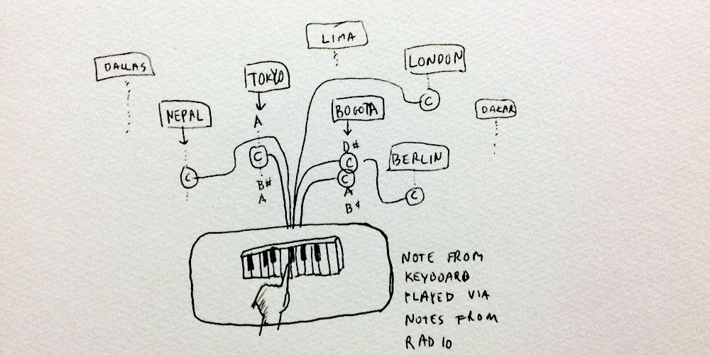

# Play the world

## Authors
- Zach Lieberman - https://github.com/ofZach

## Description
Visitors are invited to perform with a keyboard that finds samples with the same note in realtime from web radio stations from around the world, essentially allowing them to play the world.   Pressing a middle C key, for example, will play a matching C note from Nigerian sports radio or a Brazillian Bassa Nova station.  The project monitors hundreds of diverse streams, from talk radio to pop to experimental transmission from around the world.  The installation will have speakers in round, and sounds will be presented in geographic orientation to the audience, highlighting the voluminous, enchanting and playable global soundscape that surrounds us.

